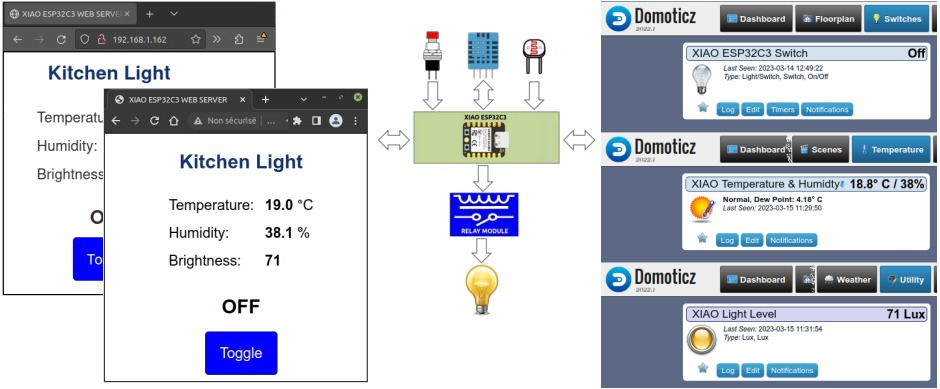

# xiao_esp32c3_wifi_switch

***XIAO ESP32C3 based Wi-Fi Switch***

**Source code that accompanies [A Wi-Fi Switch for Domoticz using a XIAO ESP32C3 - Part 1](https://sigmdel.ca/michel/ha/xiao/xiao_esp32c3_wifi_switch_1_en.html)**

## Overview of the Wi-Fi Switch

The goal is to try to reproduce the basic functionality of Theo Arends' powerful [Tasmota](https://github.com/arendst/Tasmota) firmware which is used in many home automation devices. This is very ambitious, and consequently a step-by-step approach will be adopted. The end result will not be equivalent to Tasmota by any means but hopefully something will have been learned.

The image below shows the interaction between the microcontroller board, a XIAO ESP32C3, with an attached push button, a light level sensor, and a temperature and humidity sensor. As can be seen, it is connected to web browsers and a Domoticz home automation server.

 It's not just a matter of toggling a LED on and off with a button on a Web page; numerous examples can be found on the Web. Whenever the state of the light is changed locally with the button, the light's status has to be updated on the Web page displayed by all clients connected to the Web server and in the home automation system. Similarly, if the toggle button on a client's Web page is clicked, then the hardware controlling the light must be activated accordingly and the light's status must be updated in the home automation system and on all connected clients' Web page simultaneously. Likewise, if the virtual light switch in the home automation system is toggled on or off, the actual relay on the Wi-Fi switch must be updated and the new status of the light must be shown on all connected clients' Web pages.

## Projects 

All projects are independent and self-contained.

Private copies of the needed libraries are provided in the shared [`libraries`](libraries) directory, so it should be possible to compile all the projects without installing any library.

All projects will compile and run in the PlatformIO and Arduino IDEs as long as the ESP32 platform in installed and the correct board is selected. Details are in section 6 of [A Wi-Fi Switch for Domoticz using a XIAO ESP32C3 - Part 1](https://sigmdel.ca/michel/ha/xiao/xiao_esp32c3_wifi_switch_1_en#compile1.html). 

 
### Opening a project in PlatformIO

Open a PlatformIO project by clicking on the Quick Access `Open Project` button in the Home page of PlatformIO. Then navigate to the project directory (such as `01_simplified_hdw_version`) which contains the project configuration file `platformio.ini` and click on the `Open "&lt;project&nbsp;name&gt;".

### Opening a sketch in Arduino

Open an Arduino sketch by clicking on the `File`/`Open` menu. Then navigate to the sketch file (such as `01_simplified_hdw_version\simple_wifi_switch\simple_wifi_switch.ino`) and then click on the `Open` button in the file open dialog window.

## 01_simplified_hdw_version

In this first iteration of the ESP32-C3 firmware, a hardware abstraction layer is built to handle 
  - a normally open push button,
  - a DHT20 temperature and humidity sensor connected over the I²C serial bus,
  - a light sensor based on the LS06-S.

A future hardware layer [03_alt_wifi_switch](03_alt_wifi_switch) includes support for more types of sensors.

The asynchronous web server is capable of handling multiple clients at the same time. Each Web client reloads the Web page every five seconds because the HTML page served has a refresh meta tag. 

This project corresponds to sections 2 to 5 of [A Wi-Fi Switch for Domoticz using a XIAO ESP32C3 - Part 1](https://sigmdel.ca/michel/ha/xiao/xiao_esp32c3_wifi_switch_1_en.html).

## 02_basic_wifi_switch

Integration of the Wi-Fi switch into the home automation system Domoticz is added in this second iteration of the ESP32-C3 firmware. Communication with the Domoticz server is done with HTTP requests.

Domoticz can be used to easily modify the behaviour of the Wi-Fi switch so that it becomes a timed light which stays off after a given period of time or an auxiliary light that gets turned on and off whenever another Domoticz controlled switch is turned on or off. It is also very easy to transform the Wi-Fi switch into a night light that turns on at dusk and back off at sunrise in Domoticz. The [../lua](../lua/) directory contains a dzVents Lua script that turns the Wi-Fi switch on or off based on the light level measured by the on-board sensor.

The [../lua](../lua/) directory contains a dzVents Lua script that automatically adjusts the humidity status displayed for all Domoticz supported devices that measure temperature and humidity and optionally barometric pressure. 

This project corresponds to sections 7 and 8 of [A Wi-Fi Switch for Domoticz using a XIAO ESP32C3 - Part 1](https://sigmdel.ca/michel/ha/xiao/xiao_esp32c3_wifi_switch_1_en.html).

## 03_alt_wifi_switch

This third project is project 2 but with a different hardware abstraction layer. It can handle three types of temperature and humidity sensors (DHT11, DHT20 or DHT22) and two types of light level sensors (LDR or LS06-S photodiode). Additionally, a temperature and humidity sensor can be emulated and the same is possible with the light level sensor. Finally, a rolling average of the light level measurements can be enabled to smooth out fluctuations caused by clouds or other passing shadows. 

This project corresponds to section 10 of [A Wi-Fi Switch for Domoticz using a XIAO ESP32C3 - Part 1](https://sigmdel.ca/michel/ha/xiao/xiao_esp32c3_wifi_switch_1_en.html).

## 04_ajax_update

Full Web page reloading using a refresh meta tag is replaced by asynchronous JavaScript and XML (AJAX) based Web page updates.

This project will be described in an upcoming post [A Wi-Fi Switch for Domoticz using a XIAO ESP32C3 - Part 2](https://sigmdel.ca/michel/ha/xiao/xiao_esp32c3_wifi_switch_2_en.html).

## 05_websocket_update

Full Web page reloading using a refresh meta tag is replaced by asynchronous websocket based Web page updates.

This project will be described in an upcoming post [A Wi-Fi Switch for Domoticz using a XIAO ESP32C3 - Part 2](https://sigmdel.ca/michel/ha/xiao/xiao_esp32c3_wifi_switch_2_en.html).

## 06_sse_update

Full Web page reloading using a refresh meta tag is replaced by asynchronous Server-Sent Events (SSE) based Web page updates.

This project will be described in an upcoming post [A Wi-Fi Switch for Domoticz using a XIAO ESP32C3 - Part 2](https://sigmdel.ca/michel/ha/xiao/xiao_esp32c3_wifi_switch_2_en.html).

### About the last 3 xxx_update projects

It seems that [A Wi-Fi Switch for Domoticz using a XIAO ESP32C3 - Part 2](https://sigmdel.ca/michel/ha/xiao/xiao_esp32c3_wifi_switch_2_en.html) is not about to be available in the near future, so a short explanation might be in order about these last three projects. They present 3 techniques that could be used to update the information displayed on the Web page without reloading the page itself as done in the first three projects. Tasmota uses AJAX, but Server-Sent Events will be used in further developments.

## 07_with_log

Carrying on from `06_sse_update`, this version adds a *private* logging facility. It is implemented as a FIFO queue with replacement of older entries when adding a log message when the queue is already full. That way, it is possible to log messages in an interrupt service routine and even before the serial port is up. Actually sending log messages is done safely in the `loop()` thread. Started to remove blocking operations. There is no longer any waiting for the WiFi connection in `setup()`. Similarly failed initialization of the temperature sensor will no longer block the execution of the firmware. 

There is still a problem with HTTP requests to a missing Domoticz server or to an incorrect address. Request will still block until a timeout is reached. Currently, the timeout is set at the lowest possible value (1 second), so firmware will not respond to the button during that time. The solution would seem to be to find an asynchronous HTTP request library or to make each request in a separate thread or task.

## License

Copyright 2023, Michel Deslierres. No rights reserved. 

While the copyright pertaining to included libraries by others must be respected, all the source code in this repository created by Michel Deslierres is in the public domain. In those jurisdictions where this may be a problem the [BSD Zero Clause License](https://spdx.org/licenses/0BSD.html) applies.
